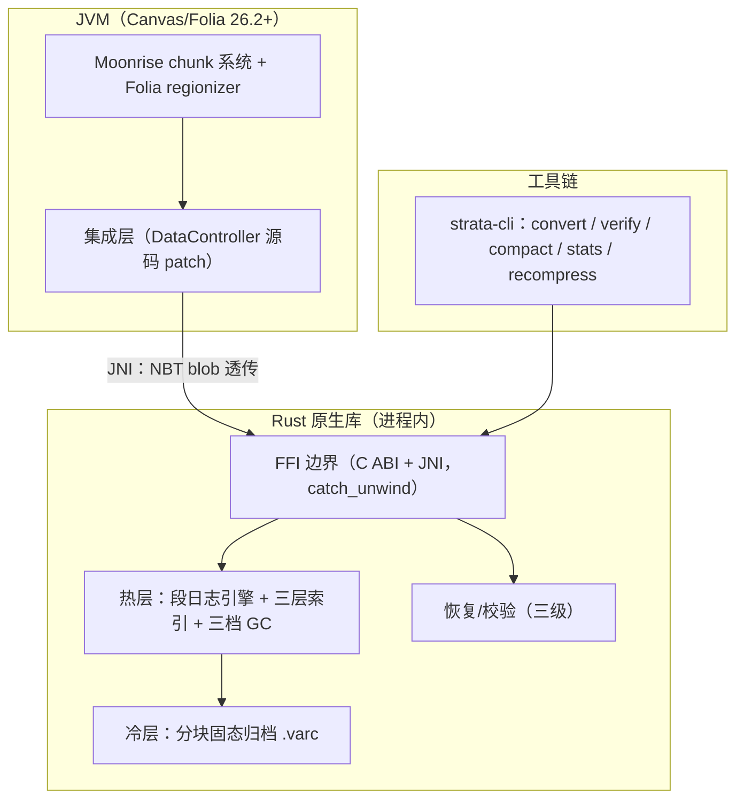

# Strata

[](https://github.com/wosnxn123/strata/actions/workflows/ci.yml)
[](./LICENSE)
[](https://www.rust-lang.org/)

**Strata** —— Minecraft 服务端（Paper/Folia/Canvas 系）的 Rust 混合双层存储引擎：**段日志热层 + 分块固态冷归档**，体积 ↓45%、内存与世界大小无关、逐条 xxhash 自愈。

**Strata** — a Rust hybrid two-tier storage engine for Minecraft servers (Paper/Folia/Canvas family): **segment-log hot tier + blocked solid cold archive**. ~45% smaller than Anvil, memory bounded independently of world size, per-record xxhash self-healing.

---

## 🚀 使用教程 / Usage Tutorial

> Strata 替换的是服务端**内部的区块存储后端**（不是文件格式插件），因此必须使用**内置 Strata 集成的服务端构建**，再通过配置启用。
>
> Strata replaces the server's **internal chunk storage backend** (it is not a file-format plugin), so you must run a **server build with Strata integrated**, then enable it via config.

### 1. 获取带 Strata 的服务端 / Get a Strata-enabled server

- **Canvas（主集成目标 / primary target）**：使用 [wosnxn123/Canvas](https://github.com/wosnxn123/Canvas) 构建的 paperclip jar（Strata 补丁已内置）。构建方式见该仓库与 [BUILD_GUIDE.md](BUILD_GUIDE.md)。
  Use the paperclip jar built from [wosnxn123/Canvas](https://github.com/wosnxn123/Canvas) (Strata patches included). See that repo and [BUILD_GUIDE.md](BUILD_GUIDE.md).
- **其它 Paper/Folia 系服务端 / other Paper/Folia forks**：按 [docs/SERVER_SUPPORT.md](docs/SERVER_SUPPORT.md) 与 [BUILD_GUIDE.md](BUILD_GUIDE.md) 将源码补丁嵌入你的 fork 后自行构建。
  Embed the source patches into your own fork following [docs/SERVER_SUPPORT.md](docs/SERVER_SUPPORT.md) and [BUILD_GUIDE.md](BUILD_GUIDE.md).

构建产物 paperclip 中已内嵌对应平台的 native 库（`strata_ffi.dll` / `libstrata_ffi.so`）。若 native 缺失或加载失败，服务器**自动回退 Anvil**，不会崩溃。
The paperclip artifact embeds the platform native library (`strata_ffi.dll` / `libstrata_ffi.so`). If the native is missing or fails to load, the server **falls back to Anvil automatically** — it never crashes.

### 2. 启用 Strata / Enable Strata

在世界根目录（与 `level.dat` 同级）创建或编辑 `strata.properties`：
Create or edit `strata.properties` in the world root (next to `level.dat`):

```properties
strata.enabled=true
```

首次启动会自动生成带完整注释的配置模板（默认 `strata.enabled=false`）。
On first start a fully commented template is generated (default `strata.enabled=false`).

启动日志出现以下两行即表示接管成功：
These two log lines confirm Strata took over:

```
[Strata] [strata] native bridge loaded, version strata-ffi 0.1.0
[Strata] [strata] virtual store online for <world> (root=<world>/<dim>/vstore)
```

### 3. 每个世界、每个维度一个存储池 / One store per world, per dimension

- **多维度**：主世界、下界、末地各自拥有独立 vstore（`<维度目录>/vstore`，与该维度的 `region/` 同级）。
  **Multi-dimension**: overworld, nether and end each get their own vstore (`<dimDir>/vstore`, next to that dimension's `region/`).
- **多世界**：Multiverse 等插件创建的世界是普通世界根，各自读自己的 `strata.properties`，自动接管。
  **Multi-world**: worlds created by plugins (e.g. Multiverse) are ordinary world roots; each reads its own `strata.properties` and is handled automatically.

### 4. 转换已有的 Anvil 世界 / Convert an existing Anvil world

服务器停机时，用 CLI 原地转换（Cesium 式：覆盖目标、保留源、断点续传）：
With the server stopped, convert in place using the CLI (Cesium-style: overwrites target, keeps source, resumable):

```bash
strata-cli convert --to-strata <world>   # Anvil → Strata（全部维度 / all dimensions）
strata-cli convert --to-anvil <world>    # Strata → Anvil（反向回滚 / rollback）
```

也可以在服务端启动参数中转换（启动前同步执行）：
Or convert via server launch flags (runs synchronously before boot):

```
--strataConvertToStrata    # Anvil → Strata
--strataConvertToAnvil     # Strata → Anvil
```

转换**绝不删除源文件**（`region/` 等），验证无误后手动删除。
Conversion **never deletes the source** (`region/` etc.); remove it manually after verification.

多世界服务器：对每个世界根各执行一次。
For multi-world servers: run once per world root.

### 5. 维护命令 / Maintenance commands

```bash
strata-cli verify <world>       # 校验全部 vstore（逐条哈希）/ verify all vstores
strata-cli stats <world>        # 体积/记录统计 / size & record stats
strata-cli compact <world>      # 手动 GC 压实 / manual GC compaction
strata-cli recompress <world>   # 按当前配置全量重压 / full recompress with current config
```

### 6. 关闭与回滚 / Disable and rollback

1. `strata.enabled=false`（或删除配置）→ 服务器回到 Anvil 路径（vstore 保留）。
   Set `strata.enabled=false` (or remove the file) → the server returns to the Anvil path (vstore retained).
2. 需要彻底回到 Anvil 文件：`strata-cli convert --to-anvil <world>`。
   To fully return to Anvil files: `strata-cli convert --to-anvil <world>`.

---

## ✨ 特性 / Features

- 🗜️ **体积最小 / minimal footprint**：热层段日志 + 冷层分块固态归档，混合整体体积较 Anvil（~75% 空间效率）降低 **45%+**（实测 0.097× 于高可压缩负载）。
  Hot segment log + cold blocked archive; **45%+** smaller than Anvil overall (measured 0.097× on highly compressible workloads).
- 🧠 **内存有界 / bounded memory**：存储层内存占用**与世界大小无关**——常驻仅几十 MB，索引缓存上界可配；10 TB 级存档（2b2t 量级）同样适用。
  Storage memory is **independent of world size** — tens of MB resident, configurable index cache cap; suitable for 10 TB-class worlds.
- 🔧 **崩溃自愈 / crash-safe**：epoch 回放恢复 + manifest 影子双副本；单条记录 xxhash64 逐条校验，损坏只隔离该条、不传播。
  Epoch-log recovery + shadow dual-copy manifest; per-record xxhash64 verification isolates corruption to the single record.
- 🔁 **Cesium 式双向转换 / bidirectional conversion**：CLI 或启动参数在 Strata 与 Anvil 之间原地互转，断点续传，多维度全覆盖。
  In-place Strata ⇄ Anvil conversion via CLI or launch flags, resumable, covering all dimensions.
- 🎛️ **配置即改即生效（混存）/ live config mixing**：每条记录自带 codec/字典槽/代际，任意时刻修改压缩配置，新旧记录自由共存。
  Every record carries its own codec/dictionary/generation; compression config can change anytime, old and new records coexist.
- 🧵 **Folia 无锁并发 / Folia-friendly concurrency**：分区写入 + SIEVE 近免锁缓存，原生适配 regionizer 多线程模型；批量压缩线程数可配（默认串行，TPS 优先）。
  Partitioned writes + near-lock-free SIEVE cache; batch-compression thread count is configurable (default serial, TPS-first).

---

## 🏗️ 架构 / Architecture



- **热层 / hot tier**：段日志追加写 + 生命周期分桶（Young/Active/Stable）+ 三档 GC（hole-punch 挖洞 / 整段删除 / 压实重写）。
  Append-only segment log + lifecycle buckets + three-stage GC (hole-punch / whole-segment delete / scored compaction).
- **冷层 / cold tier**：region 对齐的只读 `.varc` 分块归档，块级 zstd 压缩 + 块索引随机访问，失效超限自动降级回热层。
  Region-aligned read-only `.varc` blocked archive, block-level zstd + block index, auto-demote back to hot when invalid ratio exceeds threshold.
- **恢复 / recovery**：epoch 日志回放 → manifest 双副本 → 信封全扫描重建，三级递进。
  Epoch-log replay → dual-copy manifest → full envelope resync scan, escalating in three levels.

---

## ⚙️ 配置 / Configuration

世界根目录（与 `level.dat` 同级）的 `strata.properties`，Java properties 格式。完整注释模板由服务器/CLI 首次运行自动生成，内容如下：
`strata.properties` in the world root (next to `level.dat`), Java properties format. The fully commented template below is generated automatically on first run:

```properties
# Strata storage configuration / Strata 存储配置
# Master switch (default off — opt in) / 总开关（默认关闭，需显式启用）
strata.enabled=false
# Cold tier (hot -> cold migration) / 冷层（热→冷迁移）
strata.tiering.enabled=true
strata.tiering.stable-flushes=30
strata.tiering.invalid-demote-ratio=0.25
# Compression / 压缩
strata.compression.hot-enabled=true
strata.compression.cold-enabled=true
strata.compression.hot=zstd-3
strata.compression.cold=zstd-9
strata.compression.dictionary=true
# Batch compression workers: 0=auto(all cores) 1=serial(default, TPS-first) N>=2=capped
# 批量压缩线程：0=自动(全核) 1=串行(默认,TPS优先) N≥2=限N线程
strata.compression.threads=1
# Index memory budget (MiB) / 索引内存预算（MiB）
strata.index.cache-mb=512
# GC / 垃圾回收
strata.gc.enabled=true
strata.gc.invalid-threshold=0.6
strata.gc.budget-bytes=33554432
```

---

## 📚 文档 / Documentation

- [设计规格 / Design spec：Strata 混合双层存储引擎](docs/superpowers/specs/2026-08-04-strata-storage-design.md)
- [实施计划 / Implementation plan：strata-core Phase 1](docs/superpowers/plans/2026-08-04-strata-core-phase1.md)
- [服务端支持状态 / Server support matrix](docs/SERVER_SUPPORT.md)
- [构建指南 / Build guide（自构建嵌入教程）](BUILD_GUIDE.md)
- [基准结果 / Benchmark results](benches/RESULTS.md)

---

## 📄 License

本项目基于 [MIT License](./LICENSE) 开源。Copyright (c) 2026 Snowflake (wosnxn123).
Licensed under the [MIT License](./LICENSE).
