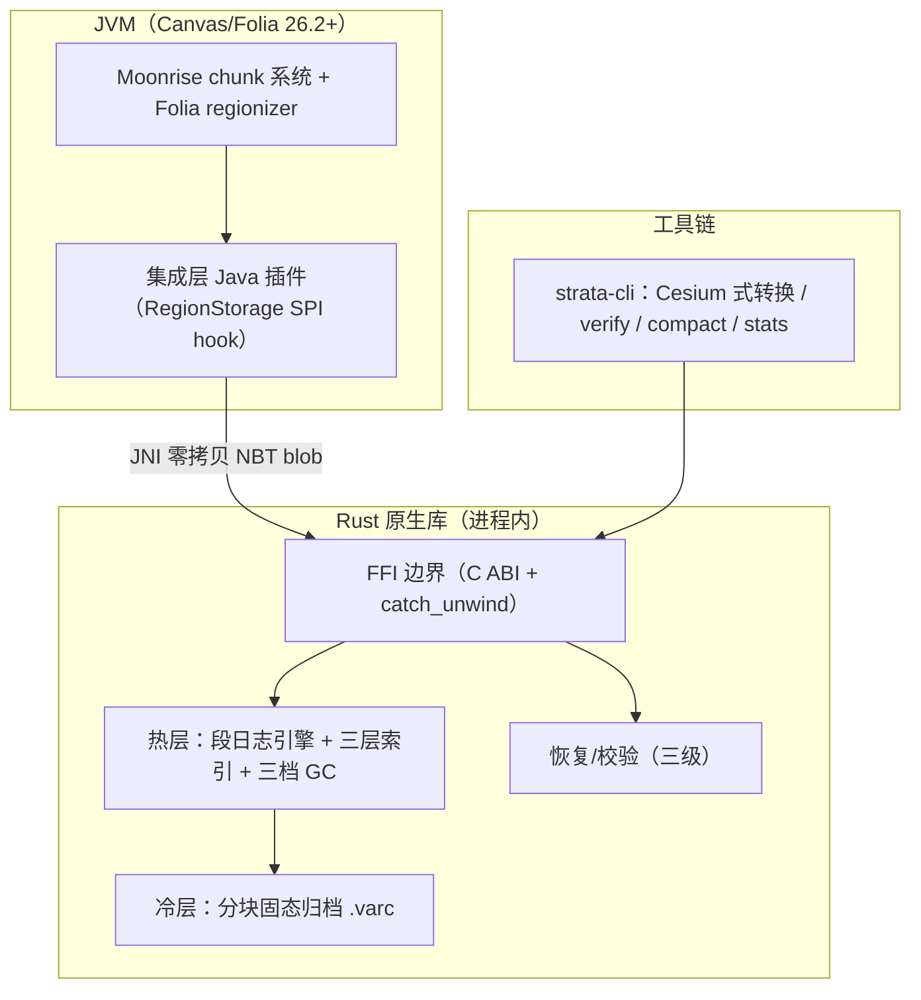

# Strata

[](https://github.com/wosnxn123/strata/actions/workflows/ci.yml)
[](./LICENSE)
[](https://www.rust-lang.org/)

**Strata** —— Minecraft 服务端（Paper/Folia/Canvas 系）的 Rust 混合双层存储引擎：**段日志热层 + 分块固态冷归档**，体积 ↓45%、内存与世界大小无关、逐条 xxhash 自愈。

---

## ✨ 特性

- 🗜️ **体积最小**：热层段日志 + 冷层分块固态归档，混合整体体积较 Anvil（~75% 空间效率）降低 **45%+**。
- 🧠 **内存有界**：存储层内存占用**与世界大小无关**——常驻仅几十 MB，索引缓存上界可配；10 TB 级存档（2b2t 量级）同样适用。
- 🔧 **崩溃自愈**：与原版等价的 autosave 原子性 + epoch 回放恢复；单条记录 xxhash64 逐条校验，损坏只隔离该条、不传播。
- 🔁 **Cesium 式双向转换**：启动参数或 CLI 一键在 Strata 与 Anvil 之间原地互转，支持断点续传。
- 🎛️ **配置即改即生效（混存）**：每条记录自带 codec/字典槽/代际，任意时刻修改压缩配置，新旧记录自由共存。
- 🧵 **Folia 无锁并发**：shard-per-region 分区写入 + SIEVE 近免锁缓存，原生适配 Folia regionizer 多线程模型。

---

## 🏗️ 架构



- **热层**：段日志追加写 + 生命周期分桶（Young/Active/Stable）+ 三档 GC（hole-punch 挖洞 / 整段删除 / 压实重写）。
- **冷层**：region 对齐的只读 `.varc` 分块归档，块级 zstd 压缩 + 块索引随机访问，失效超限自动降级回热层。
- **恢复**：epoch 日志回放 → manifest 双副本 → 信封全扫描重建，三级递进。

---

## 🚀 快速开始

> ⚠️ **Phase 1 开发中**：`strata-core` 引擎与 CLI 正在落地，以下用法为预告。

转换（Cesium 式，原地覆盖，源格式保留需手动删除）：

```bash
strata-cli convert --to-strata <world>   # Anvil → Strata
strata-cli convert --to-anvil <world>    # Strata → Anvil（反向）
```

服务端启用：在世界根目录放置 `strata.properties` 并将 `strata.enabled` 设为 `true`（默认关闭）。

---

## ⚙️ 配置示例

世界根目录（与 `level.dat` 同级）的 `strata.properties`，Java properties 格式：

```properties
# 总开关（默认 false——必须显式启用）
strata.enabled=false
# 冷层（轴 1：容器分层）
strata.tiering.enabled=true
strata.tiering.stable-flushes=30
strata.tiering.invalid-demote-ratio=0.25
# 压缩（轴 2：与轴 1 正交）
strata.compression.hot-enabled=true
strata.compression.cold-enabled=true
strata.compression.hot=zstd-3
strata.compression.cold=zstd-9
strata.compression.dictionary=true
# 索引内存上界
strata.index.cache-mb=512
# GC
strata.gc.enabled=true
strata.gc.invalid-threshold=0.6
strata.gc.budget-bytes=33554432
```

---

## 📚 文档

- [设计规格：Strata 混合双层存储引擎](docs/superpowers/specs/2026-08-04-strata-storage-design.md)
- [实施计划：strata-core Phase 1](docs/superpowers/plans/2026-08-04-strata-core-phase1.md)
- [服务端支持状态](docs/SERVER_SUPPORT.md)

---

## 📄 License

本项目基于 [MIT License](./LICENSE) 开源。Copyright (c) 2026 Snowflake (wosnxn123)。
