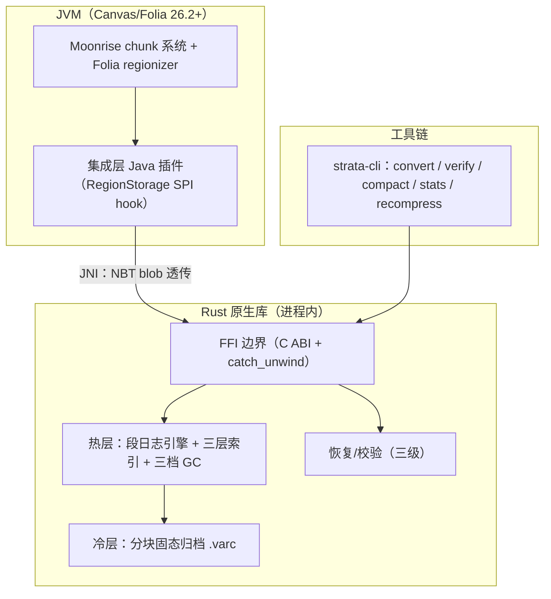

# Strata —— Minecraft 服务端 Rust 混合双层存储引擎设计

**状态**: 设计 v2（架构重写，整合 2024–2026 文献与全部已确认需求）
**日期**: 2026-08-04（v2 重写）
**目标基线**: Canvas (Folia fork) 26.2+，后续 Paper / Arclight 适配
**形态**: 进程内 Rust 原生库（JNI），嵌入 JVM 服务端
**默认状态**: **关闭**（`strata.enabled=false`），需显式启用

---

## 1. 背景与动机

Minecraft 服务端默认 Anvil (`.mca`) 格式存在三类结构性问题：

1. **空间浪费**：4KB 扇区寻址，而典型 chunk 压缩后远小于 4KB，空间效率仅 ~74%（SectorFile 实测）。
2. **头部脆弱**：region 头部损坏即丢失全部定位信息，原版无恢复逻辑。
3. **写放大与同步 fsync**：就地更新 + 逐 chunk 同步写，IO 路径不友好。

本项目基于 2024–2026 存储/数据库/文件系统顶会成果，设计一套全新容器格式，目标：

- **体积最小**：混合双层（热层段日志 + 冷层分块固态归档），预期整体 45–55%。
- **内存有界**：存储层内存 **与世界大小无关**（原版 Paper 在 TB 级存档上的性质，严格保持）——这是支持 2b2t 级几十 TB 存档的硬前提。
- **性能最优**：顺序追加写 + 生命周期分组 + 三档 GC + 异步批量 IO。
- **长期兼容**：信封式记录，Rust 永不解析 NBT 内部，未来版本自动透传。
- **插件透明**：Bukkit/Paper API 层完全无感知。
- **崩溃安全**：与原版等价的 autosave 原子性 + epoch 回放恢复。

### 学术依据（2024–2026，含采纳/不采纳决定）

| 文献 | 会议/年份 | 结论 | 决定 |
|---|---|---|---|
| DOGI | FAST'26 | 生命周期感知数据放置，GC 写放大 ↓23% | **采纳**：热层按年龄/热度分桶 |
| DisCoGC | FAST'26（字节生产） | discard 式 GC 不搬移存活数据，TCO ↓20% | **采纳**：hole-punch 三档 GC |
| ArceKV / ElasticLSM | VLDB'26 | 打分制在线压实决策，动态负载快 2.17–2.92× | **采纳简化版**：打分选受害者（不做多层弹性结构） |
| SIEVE | NSDI'24 | FIFO 变体淘汰：命中率 ≥LRU、访问近乎免锁、O(1) 扫描 | **采纳**：索引页缓存淘汰（Folia 多线程友好） |
| S3-FIFO | SOSP'23 | 三 FIFO 队列达 LRU 级命中率 | 备选，SIEVE 更简单 |
| CARMI | VLDB'22 | 缓存感知学习索引，内存可调 | 理念采纳：`cache-mb` 可调上界 |
| Bourbon | OSDI'20 | LSM 学习索引内存 ↓3× | **不采纳**：region 占用位图对 MC 坐标键空间是 O(1) 精确查询，优于任何学习索引 |
| RocksDB partitioned index + block cache | 生产实践 | 索引落盘 + 有界缓存 → PB 级可跑 | **采纳**：三层索引模型 |
| SlimDB | CMU | 紧凑前缀共享索引 | 参考：索引页前缀压缩 |
| AutoCSF | arXiv 2026-03 | 偏斜负载内存最优索引 | **不采纳**：位图已精确且更省 |
| RubikFS | FAST'26 | 相似度聚类压缩 +42.6% | **采纳轻量版**：superfeatures sketch 排序（不建相似度图） |
| EROFS pcluster / zstd seekable | Linux 内核 2024 / 官方 | 块级压缩 + 块索引随机访问 | **采纳**：.varc 分块格式 |
| Ananke | FAST'25（Best Paper） | 自然事务边界崩溃恢复 | **采纳**：epoch 对齐 autosave |
| LavaStore | VLDB'24（字节生产） | 专用引擎 > 通用引擎；严格内存上界铁律 | 印证：不走 LMDB 路线 |
| Meterstick | ICPE'23 | MC 类负载高波动、尾延迟敏感 | 印证：GC 默认自适应节流 |
| F2FS node footer（源码实证） | FAST'15+ | 24B 自描述页脚 + checkpoint 版本链 | 印证：信封瘦身 52B→40B |
| RocksDB WAL 7B 头 | 生产 | 头不含键、恢复靠上层 | 对照：我们保留自描述（扫描重建需要） |
| sbk 2026 实测 | 社区基准 | zstd-9 48.8%、lzma2 45.6% 但慢 50× | 热 zstd-3 / 冷 zstd-9 的依据 |
| NTFS FSCTL_SET_ZERO_DATA | Microsoft 文档 | Windows 打洞等效：稀疏置零，粒度 64KB | **采纳**：GC 挖洞跨平台双实现 |

---

## 2. 关键决策（全部已与需求方确认）

| 决策项 | 选择 |
|---|---|
| 集成形态 | 进程内 JNI（Rust 原生库嵌入 JVM） |
| 容器形态 | 全新容器格式（非 Anvil 外壳改造） |
| 数据覆盖 | 全部世界持久化数据（region/entities/poi + playerdata/stats/advancements + savedata/地图等），不含服务端配置文件 |
| 一致性模型 | 原版等价 + 原子记录（epoch 对齐 autosave） |
| 架构方案 | 混合双层：热层段日志 + 冷层分块固态归档 |
| 目标基线 | Canvas (Folia) 26.2+ 优先 |
| 默认启用 | **false**（`strata.enabled=false`，显式启用） |
| 转换行为 | Cesium 式：启动参数/CLI 触发、原地覆盖、**源格式保留需手动删除** |
| 配置载体 | 世界根目录 `strata.properties`（Java properties 格式） |
| 内存模型 | 有界：位图常驻随活跃段数增长（Σ 段×distinct region×384B，见 §4 如实修正），索引缓存 `cache-mb` 严格封顶，与世界总大小无关 |

### 存储引擎形态说明

Strata 的热层段日志**就是存储引擎本体**（自带索引/GC/崩溃恢复，等价于专用数据库）。不引入通用嵌入式 KV（LMDB/RocksDB/redb）——通用引擎的 B+ 树 CoW 写放大、单写者事务、冷热混排均不适配 MC chunk 负载（大 blob、空间聚集、region 对齐）。不存在"关闭两层只用数据库"的状态：关引擎即 `strata.enabled=false` 回 Anvil。

---

## 3. 总体架构



### 代码组织（cargo workspace）

| crate | 职责 |
|---|---|
| `strata-core` | 容器格式、段引擎、三层索引、GC、冷归档、恢复——纯 Rust，零 JVM 依赖 |
| `strata-ffi` | C ABI + JNI 符号层（手写 JNI FFI，零依赖），所有跨边界调用 `catch_unwind` 包裹 |
| `strata-cli` | Cesium 式双向转换器（多维度）、`verify`、`compact`、`stats`、`recompress`、`strata.properties` 加载器 |
| `java-bridge`（Java，仓内源码） | JNI 绑定 + 启动转换钩子 + `/strata` 命令源码；以 weaver patch 形式集成进 Canvas fork（无独立运行时插件） |

### 磁盘布局（每 dimension 一个存储池）

```
world/dimensions/minecraft/overworld/
├─ vstore/
│  ├─ manifest.vsm (+ .bak)      # 影子双副本：格式版本(v3)/epoch/段表/冷索引（无 region 位图）
│  ├─ .strata.lock               # 会话锁（独占，进程持有期间存在）
│  ├─ segments/seg-0001.vseg     # 热层追加段（单活跃段追加）
│  ├─ segments/seg-0001.vix      # 每段一个磁盘索引页（排序数组 + 前缀压缩）
│  ├─ cold/r.X.Z.varc            # 冷层分块归档（region 对齐，1024 chunk/个）
│  ├─ epoch/current.velog        # 当前 autosave 周期日志
│  ├─ dict/                      # 保留位：per-type zstd 字典已停用（当前版本不产生字典文件）
│  └─ .convert-progress          # 转换进度（仅转换期间存在）
├─ level.dat / data/ ...         # 未纳入部分保持原样
```

### 长期兼容承诺

1. **信封式记录**：记录外壳与 NBT 负载解耦，Rust 永不解析 NBT 内部 → 未来任意版本 NBT 结构变化自动透传。
2. **未知类型透传**：manifest 与信封保留未知 type id，未来新数据类型不破坏旧引擎。
3. **混存自由**：每条记录自带 codec/字典槽/代际 → 任意时刻改配置，新旧记录共存，读取永远不依赖当前配置。

---

## 4. 内存模型（支持 TB 级存档的核心）

**原则：内存占用取决于活跃区域与配置上界，与世界总大小无关**（与原版 Paper 同性质）。

### 三层索引

```
┌─ L0 常驻（位图 = Σ 段×distinct region×384B，与世界总大小弱相关）────┐
│  段表：每段 ID/文件/桶/打分统计（KB/段）                     │
│  每段 region 占用位图：128B/region/type × 3 类型 = 384B/段·region │
│    （manifest v3 已移除全局位图快照；位图只按段存在，启动时从     │
│     各段 .vix 索引页重建）                                     │
│    → 未生成 chunk 负查询 O(1) 位操作，零磁盘 IO（MC 领域特化，   │
│      优于任何布隆/学习过滤器：位图精确且 1 bit/槽）           │
├─ L1 有界缓存（strata.index.cache-mb，默认 512）─────────────┤
│  热点索引页 —— SIEVE 淘汰（访问只置位、淘汰手扫描，           │
│  Folia 多线程近乎免锁；NSDI'24 命中率 ≥LRU）；                │
│  已接入读路径：load_page 先查缓存，miss 才读磁盘并回填        │
├─ L2 磁盘（无界）─────────────────────────────────────────────┤
│  每段一个 .vix 索引页文件：排序数组 + 键前缀压缩（SlimDB 式）  │
│  GC 压实时随段重写；崩溃后按需从信封扫描重建                   │
└──────────────────────────────────────────────────────────────┘
```

**读路径**：位图判存在（不存在直接返回，零 IO）→ L1 查 → miss 读磁盘索引页（1–2 次 IO，与原版打开 region 读 8KB 头同量级）→ 段文件取记录。

**内存上界测算**（常驻 = 段表 + 每段位图；位图内存 = Σ 段 × distinct region × 384B）：

| 存档规模 | 常驻 | 缓存上界（可配） | 合计上界 |
|---|---|---|---|
| 10 GB 小服 | ~5 MB | 512 MB | ~520 MB |
| 10 TB（2b2t 级，~5 万 region×3 类型） | Σ 段×distinct region×384B + 段表 | 512 MB | 负载相关 |

**如实修正**：位图是每段的（manifest v3 已移除全局 region_bitmaps——死字节）。重写负载下（段滚动频繁、每段覆盖 region 多）常驻内存**高于原估算**；缓解靠 GC 整段删除死段（对应位图随之释放），L1 则严格按 `cache-mb` 封顶。

**启动**：会话锁 → 读 manifest → 载入各段 `.vix` 索引页重建每段位图，O(段数)，**不扫描段文件负载**；全扫描降级为恢复/`verify` 专用路径。

---

## 5. 热层段引擎

### 写入路径（Folia 并发安全）

```
chunk 脏数据 (NBT blob)
   │ Moonrise IO 线程提交（regionizer 分区）
   ▼
单活跃段 + 全局写锁串行追加（shard-per-region 分区追加未实现）
   ▼
压缩（当前热层 codec/级别/字典槽）→ 分配 gen
   ▼
追加段尾（顺序写）+ 记 epoch 日志 + 更新内存索引
   ▼
服务端路径 write_durable：逐条 2×fsync，返回即持久（hook 成功后即删 Anvil 主副本）
批量路径 write_batch：非持久写 + 批尾一次 sync（组提交）
   ▼
autosave 时机 → flush：fsync 段 → manifest.epoch++ 并保存 → epoch rotate（原子）
```

- **段滚动**：当前段超过 `segment-max-bytes`（默认 64 MiB）滚动新段。
- **代际戳 gen**：单调递增；读路径只认最新代，GC 时旧代自然失效。
- **epoch 边界 = autosave/flush 时机**：与原版保存节奏完全一致，崩溃最多丢一个 autosave 周期。
- **持久化模型**：`Store::write` = 非持久写（只 flush 到 OS，组提交路径用）；`Store::write_durable` = 返回即持久（段 + epoch 日志逐条 sync，每记录 2 次 fsync）——服务端 JNI 路径专用：Java hook 写成功后立即 DELETE Anvil 主副本，vstore 成为唯一副本，故必须逐条持久；`write_batch` = 逐条非持久写 + 批尾一次 sync（组提交），CLI 转换/批量用，崩溃最多丢上次 flush 以来的记录（转换有进度文件续传兜底）。

### 生命周期分桶（DOGI；如实简化）

| 桶 | 判据（当前实现） | 放置 |
|---|---|---|
| Young | 首次写入 | 混合段；≥2 次 flush 后按年龄晋升 Active |
| Active | `epoch_flush_count ≥ 2`（仅年龄翻转） | 混合段 |
| Stable | 判据未实现（名义桶） | 冷层晋升由 region 年龄直接判定（见 §6），与桶状态无关 |

分桶只实现了年龄翻转（Young→Active）；DOGI 式的改写频率判据未实现，Stable 为名义桶——冷层晋升直接以"region 最近一次写入距今 ≥ `stable-flushes` 次 flush"为判据。

### 三档 GC（DisCoGC 启发 + ArceKV 打分）

按失效分布自动选择，预算（`gc.budget-bytes`）节流。**服务端随 autosave 周期在线运行**：每 `stable-flushes` 次成功 flush 触发一轮 GC+tier（启动不做全量扫描）；CLI `compact` 为离线手动档（需停服，见 §10）：

1. **hole-punch 挖洞**：稀疏失效区域直接回收，不搬移数据、零写放大。**只挖负载、保留全部 40B 信封壳**（挖洞后段仍可扫描/校验/重建）；负载区间再切 ≤32KB 子区间逐次挖（在 64KB 重同步窗口内留足余量，也契合 Linux 块对齐收缩粒度）。跨平台：Linux `fallocate(PUNCH_HOLE)`（块对齐）/ Windows `FSCTL_SET_ZERO_DATA`（稀疏置零，NTFS 粒度 64KB）→ 最小洞阈值 `strata.gc.min-hole-bytes`（默认 64KB），小于阈值不挖。挖洞产生稀疏文件（备份注意见 §12）。
2. **整段删除**：段失效比例 ≥95% → 直接删文件。
3. **压实重写**：打分选受害者 `score = 失效比例 × 段大小 / 段年龄`，预算内选分最高；存活记录原样搬迁（不重压——GC 不做重压缩）。
4. **回收不变量**：损坏但最新的记录（live-but-unreadable，唯一副本不可读）**不参与**挖洞/整段删除/压实——GC 绝不销毁唯一副本；含此类记录的段跳过压实，留给 `verify` 报告人工处置。

Meterstick 证实 MC 负载高波动 → GC 默认按前台写压力自适应节流。

---

## 6. 冷层分块固态归档（.varc）

**触发**：region 最新存活写入距当前 epoch ≥ `stable-flushes` 次 flush（年龄判据，不看桶状态）且该 region 尚无冷归档 → 晋升候选。

**构建**：提取该 region 全部记录 → **superfeatures sketch 排序**（去重文献的轻量相似度特征：对每条负载计算滚动哈希 min/max 特征值对，按特征排序使相似 chunk 相邻——替代 RubikFS 的重量级相似度图，O(1)/条、不解析负载）→ **按 64 chunk 一块分块压缩**（EROFS pcluster 式：每块独立 zstd；字典压缩已停用，见 §13）→ 写只读 `.varc`：头 + 块索引表（块号→文件偏移/解压后范围）+ 槽位索引（坐标+type→块内偏移）。

**冷读**：命中 → 读块索引 → **只解压目标块**（~64 chunk 的压缩块，内存上界 ~1–2 MB）→ 块级解压缓存（SIEVE，共享 cache-mb 预算）→ 返回单条。

**回读回填**：玩家走回冷区 → 冷读透明返回；改写该 chunk → 写热层 + 归档失效位图（`.varc.inv` 旁路文件）+1；失效比例超 `invalid-demote-ratio`（默认 0.25）→ 整归档降级回热层。

**体积**：冷数据 zstd-9 + 排序收益 ~40%；热 zstd-3 ~60%；混合整体 45–55%（Anvil ~75%）。

---

## 7. 记录信封（40 字节定长头）

```
偏移 0   [ magic 4B = "VSEG" ][ record_ver 1B ][ type_id 2B ][ comp_id 1B ]
偏移 8   [ chunk_x 4B ][ chunk_z 4B ]
偏移 16  [ gen 8B ][ epoch_ts 4B ]
偏移 28  [ payload_len 4B ][ xxhash64_payload 8B ]
偏移 40  [ ... 压缩后的 NBT 负载（payload_len 字节）... ]
```

所有整数小端。相对早期 52B 版的瘦身依据（F2FS/RocksDB/SectorFile 文献对照）：

- 删 `dim_hash`（-4B）：存储池按维度分目录，维度在路径中。
- `timestamp` 8B→4B（`epoch_ts`，u32 epoch 计数，F2FS `cp_ver` 同款）：墙钟时间由索引页承载，不入信封。
- `comp_id` 1B 双语义：低 4 位 codec（0=NONE 1=ZSTD），高 4 位字典槽（0=无字典，16 槽/维度）。
- 保留 `magic`：头部全毁时的重同步扫描锚点（SectorFile 32B 头没有，靠它我们的三级恢复第 2 级更强）。
- 保留 `gen`：最新代语义权威来源。
- 保留 `xxhash`：逐条校验 + 扫描重建验证（ZFS 式父指针存子校验会破坏单条独立可验证性，不采纳）。

小记录开销对比：poi（~500B 压缩后）元数据占比 52B 时 10.4% → 40B 时 8.0%；chunk（~30KB）<0.15%，忽略。

---

## 8. Manifest、恢复与崩溃一致性

### Manifest（manifest.vsm，影子双副本）

记录：格式版本（**v3**）、当前 epoch、next_gen/next_seg_id、段表（ID/文件/桶/live/total/打分统计）、冷索引（region→varc/失效计数）。**v3 已移除全局 region 占用位图快照**（死字节：位图改为每段持有，启动时从各段 `.vix` 索引页重建，见 §4）。

- 双副本 + 原子 rename 切换；损坏时取较新且校验通过的副本。
- **不用 RocksDB 式日志 MANIFEST 的理由**：manifest 变更频率低（flush/GC/tier 时），日志式的增量回放收益为零，快照双副本更简单且正确性等同。
- **旧版 manifest（≤v2）一律拒绝加载**：`Store::open` 自动走段扫描 + 冷区对账的重建路径完整恢复，无需人工干预。

### 恢复（三级）

1. **epoch 回放**：崩溃后读 `current.velog` 重建索引——恢复最近 autosave 之后的数据。
2. **manifest 双副本全坏 / 旧版 manifest（≤v2）** → 扫描段文件信封重建段表与索引（每条信封自带坐标/类型/gen，magic 用于重同步定位）+ **冷区对账**（未登记的可解析 `.varc` 重新注册、半截残留删除）——完整恢复，无需人工；此即"启动不扫段、恢复才扫段"的恢复路径。
3. **单条记录 hash 不匹配** → 仅该记录标记损坏并告警（索引条目 payload_hash=0），不传播。

`Store::verify` 提供全量体检报告（记录数 + 损坏清单）。

---

## 9. 配置（strata.properties）

世界根目录（与 level.dat 同级），Java properties 格式（`key=value`，`#` 注释）。CLI 与服务端 shim 共用同一加载器。**启动时加载**（不做热重载——存储参数中途切换易生歧义）；缺失文件 → 生成带注释模板 + 全默认。

```properties
# Strata storage configuration / Strata 存储配置
# Master switch (default off — opt in) / 总开关（默认关闭，需显式启用）
strata.enabled=false
# Cold tier (hot -> cold migration) / 冷层（热→冷迁移）
strata.tiering.enabled=true
strata.tiering.stable-flushes=30
strata.tiering.invalid-demote-ratio=0.25
# Compression / 压缩
strata.compression.hot-enabled=true
strata.compression.cold-enabled=true
strata.compression.hot=zstd-3
strata.compression.cold=zstd-9
# Batch compression workers: 0=auto(all cores) 1=serial(default, TPS-first) N>=2=capped
# 批量压缩线程：0=自动(全核) 1=串行(默认,TPS优先) N≥2=限N线程
strata.compression.threads=1
# Index memory budget (MiB) / 索引内存预算（MiB）
strata.index.cache-mb=512
# GC / 垃圾回收
strata.gc.enabled=true
strata.gc.invalid-threshold=0.6
strata.gc.budget-bytes=33554432
# Minimum hole bytes for punch / 挖洞最小洞阈值（字节）
strata.gc.min-hole-bytes=65536
# Emergency escape: boot on Anvil even when a vstore exists (data in vstore invisible until converted back)
# 应急逃生门：vstore 存在时仍按 Anvil 启动（vstore 内数据在转回前不可见）
strata.force-anvil=false
```

**定稿 14+1 键**（与 Rust/Java 加载器逐字节同款）：
- `strata.compression.dictionary` **已停用**：解析器仍识别旧键但 WARN 后忽略（格式槽位保留——信封 `comp_id` 的字典槽位语义不变，带字典的旧记录仍可读；`dict/` 不再产生）。
- `strata.gc.min-hole-bytes`：挖洞最小洞阈值（默认 65536，见 §5 三档 GC）。
- `strata.force-anvil`：Java 运行时应急逃生门（CLI 只解析不使用）：vstore 存在但 Strata 未接管（`enabled=false`、native 失败、open 失败）时**默认拒绝启动该 level**（fail-closed，否则 vstore 数据不可见）；置 `true` 才按 Anvil 启动，vstore 数据转回前不可见，每次启动醒目 WARN。彻底回滚见 §10/§12。
- **持久化模型**（对应 §5 写入路径）：服务端 JNI 写 = `write_durable`，**返回即持久**（每记录 2 次 fsync），因为 hook 写成功后立即删除 Anvil 主副本，vstore 成为唯一副本；CLI 转换/批量 = 非持久写 + **组提交**（`write_batch` 批尾一次 sync）+ 收尾 flush，崩溃最多丢上次 flush 以来的记录，转换进度文件续传兜底。

**级别范围**：zstd -10 ~ 22（0 非法——"库默认"语义歧义；越界报行号错误）。
**批量压缩并行策略**：`write_batch` 的压缩默认**串行**（`threads=1`），因游戏服 CPU 稀缺、TPS 优先于压缩吞吐；显式 `threads=0`（全部可用核）或 `N≥2` 时，用**有界 `std::thread::scope`** 派生 worker 分块压缩——不用 rayon 全局池（全局单例无法按 Store 限流，且会与游戏线程抢核）。结果与输入同序，任一 worker 出错即整批失败（追加尚未发生）。
**非法值** → 启动报错并指明 `strata.properties:<行号>: <原因>`，不静默回退。

### 组合合法性矩阵

| enabled | tiering | 热压缩 | 冷压缩 | 行为 |
|---|---|---|---|---|
| false | * | * | * | 回退 Anvil，忽略其余全部配置；**若 vstore 存在则 fail-closed 拒绝启动该 level**（除非 `strata.force-anvil=true`，见下） |
| true | false | off | off | 合法 + WARN（全关退化：纯段日志零压缩，体积≈Anvil none） |
| true | false | on | * | 纯热模式，冷配置忽略并提示 |
| true | true | off | on | 合法（热 NONE，晋升时才压） |
| true | true | on | off | 合法 + WARN（冷不压反而更大） |

语义要点：
- **只开热关冷**：退化为纯段日志，GC/索引/恢复照常。
- **只开冷关热**：架构不可能——冷层只读，写入必须经热层基底；该组合归约到 enabled=false。
- **准冷模式**：`stable-flushes=1` → 稳定 region 尽快晋升，热层只剩活跃写缓冲。
- 关闭压缩不损失引擎骨架收益（自愈/原子性/有界内存/GC 照常），只损失体积。

### 配置变更语义

- 压缩级别/codec：**随时可改**，只影响之后的写入；旧记录按自身 comp_id 读取（混存合法；字典键已停用，见 §9 模板说明）。读取永不回写 → 路过旧区域不触发重压；只有"改动后保存 / 冷层晋升降级 / 显式转换"三条路径用新配置。
- GC/tiering 参数：运行时调优，影响后续轮次。
- `enabled=false` 语义：Strata 运行期写过的 chunk 其 Anvil 主副本已被 DELETE；若 vstore 存在而 Strata 未接管，**fail-closed 拒绝启动该 level**（静默按 Anvil 启动会让 vstore 数据不可见）。正确回滚 = 先 `convert --to-anvil` 转回（见 §10）；`strata.force-anvil=true` 仅是应急逃生（数据不可见 + 每次启动醒目 WARN）。

---

## 10. 迁移与转换器（Cesium 式行为）

- **触发**：服务端启动参数 `--strataConvertToStrata` / `--strataConvertToAnvil`（Canvas 集成 shim 解析，已实现）；CLI 等价命令 `strata-cli convert --to-strata <world>` / `--to-anvil <world>`。转换在启动前同步执行，完成后继续启动。
- **原地覆盖**：输出写到同一世界目录目标存储；目标已存在**直接覆盖重建**（与 Cesium wiki 一致）。重复执行同方向转换 = 重新生成；转换后应移除启动参数，否则下次启动再次覆盖。
- **保留源格式**：转换**绝不删除**源（`region/`/`entities/`/`poi/` 或 `vstore/`），运维验证后**手动删除**；结束时打印醒目提示与源目录列表。
- **可恢复进度**：每 region 完成追加 `vstore/.convert-progress` 一行 + fsync；中断重跑跳过已完成；全部完成后删除进度文件。
- **全量 + 当前配置**：遍历所有 region/entities/poi `.mca`，按当前 `strata.properties` 压缩级别写 vstore；反向转 Anvil 固定 DEFLATE（Anvil 不支持 zstd）。中断期间改配置会造成混级别（合法但不一致）。
- **多维度 + 多世界**：CLI 与服务端均按维度根遍历——overworld（世界根本身）、vanilla 布局 `DIM-1`/`DIM1`、Canvas/Paper 布局 `dimensions/minecraft/<dim>`；每个维度根一个独立 vstore（`<dimroot>/vstore`）。多世界插件（Multiverse 等）创建的世界是普通世界根，逐世界执行即全兼容。
- **转换守卫（服务端四入口）**：`/strata convert-to-strata`、`/strata convert-to-anvil`、`--strataConvertToStrata`、`--strataConvertToAnvil` 在目标维度已有 vstore 时**默认拒绝**（既有 vstore 可能含更新的运行期数据），需 `-f/--force`（子命令）或 `--strataForce`（启动参数）显式确认才覆盖。convert-to-anvil 的拒绝消息额外说明：vstore 独有记录（运行期写入）不会被 Anvil 清单枚举，服务端内导出可能漏——无损全量导出用 `strata-cli convert --to-anvil`。CLI `convert` 本身按 Cesium 语义直接覆盖目标（离线工具，无守卫）。
- **会话锁互斥**：`Store::open` 与 CLI 都抢 vstore 独占会话锁 `vstore/.strata.lock`（flock/LockFileEx，锁文件内记录持有者 PID/主机名/时间）。对运行中服务的 vstore 跑 CLI 会报"另一个进程正在使用"——`compact`/`recompress`/`convert` 均需停服执行。**不支持 NFS/网络文件系统/多机共享卷**：锁与 rename/fsync/punch 语义依赖本地文件系统。

---

## 11. FFI/JNI 集成与 Folia 兼容（已实现）

- **边界形态**：Java 侧序列化 NBT→`byte[]`，JNI 经 `GetByteArrayElements` 拷入 Rust（一次拷贝；DirectByteBuffer 零拷贝未采纳——chunk 负载压缩本身是重计算，拷贝占比可忽略，换来异常/所有权语义简单）。Rust 永不解析 NBT，payload 全程不透明字节。
- **每个跨边界调用 `catch_unwind`**：Rust panic → Java `StrataException` + 日志，绝不炸 JVM。
- shim 挂在 Moonrise `DataController` 字节边界（chunk IO 线程之下、regionizer 下游），不触碰 tick 线程模型；写入经**单活跃段 + 全局写锁**（`SyncStore` 内部互斥串行化追加；shard-per-region 分区追加未实现），服务端路径逐条 `write_durable`（返回即持久，见 §5）；索引/缓存走近免锁路径（L1 SIEVE 已接入读路径）。
- 已核实：Spottedleaf SectorFile 实验开过 Folia 分支，存储层替换在 Folia 可行。
- 插件透明：Bukkit/Paper API 无感知；外部 `.mca` 工具不可直读新格式，CLI 双向转换兜底。

---

## 12. 测试策略与风险

### 测试

- `strata-core` 单元 + property-based fuzz（proptest；信封编解码、段追加/扫描、索引、GC、恢复）。
- 崩溃注入：随机在写入/fsync/epoch 切换点 kill，验证三级恢复。
- 基准（criterion）：vs Anvil 体积（目标 ≤0.65×）/写吞吐/读延迟 p50·p99；合成世界 4096 chunk。
- 集成：Canvas 无头实服烟雾**已通过**（三维度 vstore 接管、崩溃恢复、优雅停机、读回）；真实玩家负载浸泡与插件兼容性矩阵（Multiverse 实测）留待部署回归。

### 风险与缓解

| 风险 | 缓解 |
|---|---|
| Rust panic 炸服务器 | catch_unwind 全覆盖 + CI fuzz |
| 冷区回读延迟抖动 | 分块解压上界 1–2 MB + 块缓存；zstd 解压 ~50µs/chunk |
| Canvas 26.2 API 漂移 | 集成层薄 shim + 版本探测；core 与 JVM 解耦 |
| Windows hole-punch 语义差异 | FSCTL_SET_ZERO_DATA 双实现 + 64KB 最小洞阈值；基准覆盖两平台 |
| 体积收益不达预期 | superfeatures 排序 + 冷热分层已是最优组合；可回退热层级别（字典压缩已停用，不再是收益来源） |
| 双格式并存复杂度 | CLI 双向转换 + 源格式保留回滚 + 明确弃用路径 |
| 回滚路径 vstore 独有记录限制 | Strata 运行期写过的 chunk 其 Anvil 副本已 DELETE：直接 `enabled=false` 会使这些 chunk 在 Anvil 侧不可见。缓解：fail-closed 拒绝启动（`force-anvil` 逃生门 + 每次启动醒目 WARN）+ 转换守卫；彻底回滚必须 `convert --to-anvil`（服务端内导出受 vstore 独有记录枚举限制，推荐 CLI 无损全量） |
| TB 级内存失控 | 三层索引 + 启动不扫段 + 基准用 10TB 合成负载验证内存曲线平坦 |

---

## 13. 演进路线（明确不做，留给未来）

- 学习索引（Bourbon/CARMI 完整版）：键空间泛化时再评估
- ~~per-type zstd 字典压缩~~ **已停用（vaporware 下线）**：旧键 `strata.compression.dictionary` 仍识别但 WARN 忽略；信封字典槽位保留兼容（带字典旧记录可读），`dict/` 不再产生。多字典策略 / lzma2 冷层 codec 同推迟（注册表已留扩展位）
- ~~`strata-cli recompress <world>` 全量重压维护命令~~ ✅ 已实现（vstore.new 重写 + 全量哈希校验 + rename 交换，失败不动原 store）
- ~~Nether/End 维度转换~~ ✅ 已实现（多维度遍历 + 每维度独立 vstore）；多世界（插件创建的世界）同步支持
- playerdata/stats/advancements/savedata 纳入（Phase 1 仅三大件，信封 type_id 已预留）
