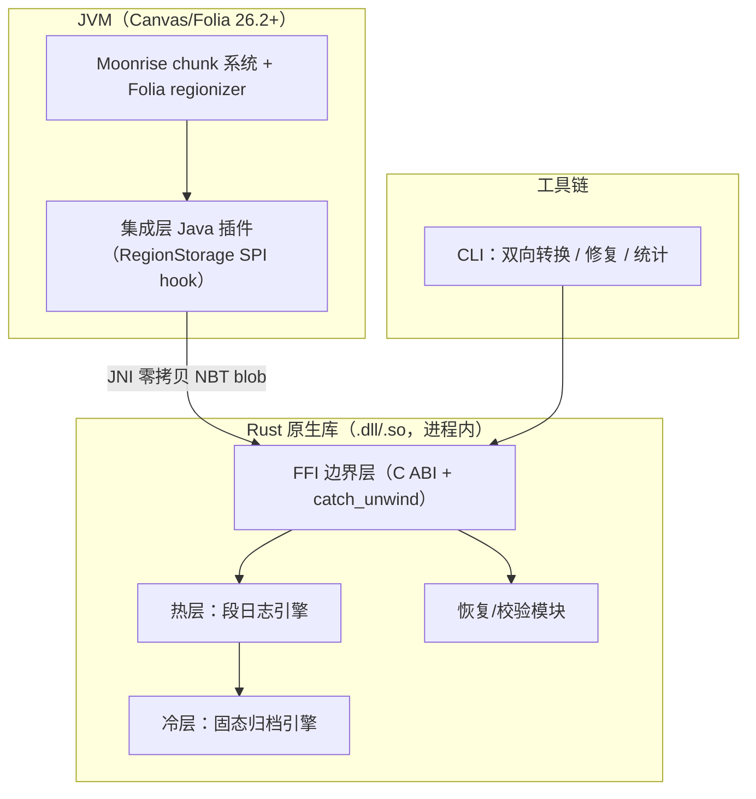

# Vault —— Minecraft 服务端 Rust 混合双层存储引擎设计

**状态**: 设计（待审阅）
**日期**: 2026-08-04
**目标基线**: Canvas (Folia fork) 26.2+，后续 Paper / Arclight 适配
**形态**: 进程内 Rust 原生库（JNI），嵌入 JVM 服务端

---

## 1. 背景与动机

Minecraft 服务端默认 Anvil (`.mca`) 格式存在三类结构性问题：

1. **空间浪费**：4KB 扇区寻址，而典型 chunk 压缩后远小于 4KB，空间效率仅 ~74%（SectorFile 实测）。
2. **头部脆弱**：region 头部损坏即丢失全部定位信息，原版无恢复逻辑。
3. **写放大与同步 fsync**：就地更新 + 逐 chunk 同步写，IO 路径不友好。

本项目基于 2024–2026 存储/数据库/文件系统顶会（USENIX FAST、OSDI、VLDB/CIDR）的最新成果，设计一套全新容器格式，目标：

- **体积最小**：混合双层（热层段日志 + 冷层固态归档），预期整体 45–55%。
- **性能最优**：顺序追加写 + 生命周期分组 GC + 异步批量 IO。
- **长期兼容**：信封式记录，Rust 永不解析 NBT 内部，未来版本自动透传。
- **插件透明**：Bukkit/Paper API 层完全无感知。
- **崩溃安全**：与原版等价的 autosave 原子性 + epoch 回放恢复。

### 学术依据（2024–2026）

| 原则 | 出处 | 映射到本设计 |
|---|---|---|
| 生命周期感知放置，GC 写放大 ↓23% | FAST'26 DOGI、FAST'24 MIDAS | 热层按 chunk 年龄/热度分桶落段 |
| KV 值分离：小键热、大值冷 | WiscTree / BVLSM / AegonKV / VLDB | 内存索引（小）热，NBT blob（大）单独存 |
| 自描述记录 + 逐条校验 | 工程印证（OSDI'25 崩溃一致性） | 信封自带坐标/类型/时间戳/xxhash |
| 小扇区寻址空间效率 ≥95% | SectorFile 实测 | 段内紧凑追加，无扇区对齐浪费 |
| 压缩选型 zstd（速度与比最优） | sbk 2026 实测（7800X3D） | 热层 zstd-3、冷层 zstd-9 + 字典 |
| epoch/自然事务边界崩溃一致性 | FAST'25 Ananke（Best Paper）、OSDI'25 | 对齐 autosave 时机做 epoch |
| 冷数据相似度聚类压缩 +42.6% | FAST'26 RubikFS | 冷层归档前聚类 + 字典压缩 |
| 异步批量 IO / io_uring | FAST'26 AITURBO | 对齐 Moonrise 异步 IO 池 |

---

## 2. 关键决策（已与需求方确认）

| 决策项 | 选择 |
|---|---|
| 集成形态 | 进程内 JNI（Rust 原生库嵌入 JVM） |
| 容器形态 | 全新容器格式（非 Anvil 外壳改造） |
| 数据覆盖 | 全部世界持久化数据（region/entities/poi + playerdata/stats/advancements + savedata/地图等），不含服务端配置文件 |
| 一致性模型 | 原版等价 + 原子记录（epoch 对齐 autosave） |
| 架构方案 | 混合双层：热层段日志 + 冷层固态归档 |
| 目标基线 | Canvas (Folia) 26.2+ 优先 |
| 转换行为 | Cesium 式：启动参数触发、原地覆盖转换、原格式文件保留需手动删除 |
| 配置载体 | 世界根目录 `vault.properties`（Java properties 格式） |

---

## 3. 总体架构



### 代码组织（cargo workspace）

| crate | 职责 |
|---|---|
| `vault-core` | 容器格式、段引擎、冷归档、索引、恢复——纯 Rust，零 JVM 依赖 |
| `vault-ffi` | C ABI + JNI 桥，所有跨边界调用 `catch_unwind` 包裹 |
| `vault-cli` | 离线双向转换器、`verify`、`compact`、`stats` |
| `vault-plugin-canvas`（Java） | Canvas/Folia 集成：hook chunk IO，Bukkit API 透明 |
| `vault-plugin-paper` / `-arclight` | 其余 fork 的薄适配 shim（后续） |

### 磁盘布局（每 dimension 一个存储池）

```
world/dimensions/minecraft/overworld/
├─ vstore/
│  ├─ manifest.vsm            # 格式版本 + epoch + 段表 + 冷归档索引（影子双副本）
│  ├─ segments/seg-0001.vseg  # 热层追加段（regionizer 分区对齐分片）
│  ├─ cold/r.X.Z.varc         # 冷层固态归档（region 对齐，1024 chunk/个）
│  └─ epoch/current.velog     # 当前 autosave 周期日志（崩溃原子性）
├─ level.dat / data/ ...      # 未纳入部分保持原样
```

### 长期兼容承诺

1. **信封式记录**：记录外壳（坐标/类型/时间戳/hash/压缩ID）与 NBT 负载解耦，Rust 永不解析 NBT 内部 → 未来任意版本 NBT 结构变化自动透传。
2. **未知类型透传**：manifest 与信封保留未知 type id，未来新数据类型不破坏旧引擎。

---

## 4. 热层段引擎（Segment Log）

### 写入路径（Folia 并发安全）

```
chunk 脏数据 (NBT blob)
   │ Moonrise IO 线程提交（regionizer 分区）
   ▼
按分区哈希 → 选段分片（shard-per-region，无锁追加）
   ▼
追加到段文件末尾（顺序写，io_uring 可选）
   │ 同时更新：
   ├─ 内存索引 (x,z,type) → (segId, offset, len, gen)
   └─ epoch 日志 current.velog
   ▼
autosave 时机 → fsync 段 + epoch → 切 epoch（原子）
```

**关键点**
- **按 Folia 分区对齐分片**：每个 regionizer 分区绑定独立段分片，追加互不竞争 → Folia 优先下无锁并发的核心。
- **代际戳（gen）**：索引条目带单调递增代际号，GC 时旧代自然失效，读路径只认最新代。
- **epoch 边界 = autosave/flush 时机**：与原版保存节奏一致，崩溃最多丢一个 autosave 周期。

### 生命周期分组（DOGI 启发）

| 桶 | 判据 | 放置 |
|---|---|---|
| 新生成 | 首次写入、无旧代 | 独立"年轻段"（最先回收） |
| 活跃 | 近期多次改写 | 混合段 |
| 稳定 | 长期未改写 | 候选迁移冷层 |

后台 GC 在 tick 空闲期运行：选失效比例超阈值的段，把存活记录重写到新段（重写即压实），旧段删除。GC 速率按前台写压力自适应节流。

---

## 5. 冷层固态归档（Solid Archive）

**触发**：连续 N 个 autosave 周期未改写的 region 对齐块（32×32=1024 chunk），且该 region 所有类型（chunk/entities/poi）均稳定 → 迁移候选。

**迁移**：读取该 region 全部记录 → 相似度聚类排序（RubikFS）→ zstd 字典压缩 → 写只读 `.varc`。

**`.varc` 特性**：只读、无碎片、无 GC、索引紧凑，读路径二分定位。

**冷区回读**：命中冷归档 → 解压回内存 → 按需回填热层（写新记录，旧归档标"部分失效"）。冷归档带失效位图，失效超阈值时重写或降级回热层。回读延迟 zstd 解压 ~50µs/chunk，首读后走热层缓存。

**体积收益**：冷 zstd-9 + 聚类字典 ~40%，热 zstd-3 ~60%，混合整体 45–55%（Anvil ~75%）。

---

## 6. 记录信封、Manifest 与恢复

### 信封（每条记录的自描述外壳，定长 52 字节头 + 负载）

```
偏移 0   [ magic 4B = "VSEG" ][ record_ver 2B ][ type_id 2B ]
偏移 8   [ chunk_x 4B ][ chunk_z 4B ][ dim_hash 4B ]
偏移 20  [ gen 8B ][ timestamp 8B ]
偏移 36  [ payload_len 4B ][ comp_id 1B ][ pad 3B ]
偏移 44  [ xxhash64_payload 8B ]
偏移 52  [ ... 压缩后的 NBT 负载（payload_len 字节）... ]
```

所有整数小端编码。外壳与负载解耦；type_id 保留未知值透传。

### Manifest（manifest.vsm，影子双副本）

记录：格式版本、当前 epoch、段表（segId→文件/范围/失效统计）、冷归档索引（region→varc 路径/失效位图）。双副本 + 原子 rename 切换，损坏时取较新且校验通过的副本。

### 恢复（三级）

1. **epoch 回放**：崩溃后读 `current.velog` 重建索引，恢复最近 autosave 之后的数据。
2. **manifest 校验失败** → 扫段文件信封重建段表（每条信封自带坐标/类型）。
3. **单条记录 hash 不匹配** → 仅该记录标记损坏并告警，不拖垮整个存档。

---

## 7. FFI/JNI 集成与 Folia 兼容

- **零拷贝**：NBT blob 经 DirectByteBuffer 传递，Rust 侧拿 `&[u8]` 直接压缩。
- **每个跨边界调用 `catch_unwind`**：Rust panic → Java 异常 + 日志，绝不炸 JVM。
- 段引擎句柄、索引查询为 `Send` 安全 Rust 结构，FFI 层用 `Arc` 共享。
- shim 挂在 Moonrise chunk IO 线程之下（regionizer 下游），不触碰 tick 线程模型。
- 段分片按 regionizer 分区哈希，写入天然无锁。
- 已核实：Spottedleaf SectorFile 实验开过 Folia 分支，存储层替换在 Folia 可行。
- 插件透明：Bukkit/Paper API 无感知；外部 `.mca` 工具不可直读新格式，CLI 提供双向转换兜底。

---

## 8. 迁移、配置、测试与风险

### 迁移与转换器（Cesium 式行为）

- **触发**：服务端启动参数 `--vaultConvertToVault`（Anvil → Vault）或 `--vaultConvertToAnvil`（Vault → Anvil）；CLI 等价命令 `vault-cli convert --to-vault <world>` / `--to-anvil <world>`。转换在服务正常启动前同步执行，完成后继续启动。
- **原地覆盖**：转换输出写到同一世界目录的目标存储（`vstore/` 或 `region/` 等），目标已存在则**直接覆盖**（与 Cesium wiki 行为一致）。重复执行同一方向的转换即重新生成目标格式——因此转换期间必须停服，且转换后应移除启动参数，否则下次启动会再次覆盖。
- **保留原格式**：转换**绝不删除**源格式文件（`region/`、`entities/`、`poi/` 或 `vstore/`），由运维确认无误后**手动删除**。两种格式短暂并存，Vault 加载时以 `vstore/` 为准，Anvil 文件仅作回滚备份。
- **崩溃安全**：转换按 region 粒度提交（每 region 转换 + fsync 后记入转换进度文件 `vstore/.convert-progress`），中断后重跑只处理未完成 region。
- Phase 2（服务端 shim）：shim 在启动早期解析这两个参数并调用 `vault-core` 转换入口，行为与 CLI 一致。

### 配置（`vault.properties`，世界根目录）

Java properties 格式（`key=value`，`#` 注释），CLI 与服务端 shim 共用同一加载器：

```properties
# vault.properties —— 放在世界根目录（与 level.dat 同级）
vault.enabled=true
vault.compression.hot=zstd-3
vault.compression.cold=zstd-9
vault.compression.dictionary=true
vault.tiering.stable-flushes=30
vault.gc.enabled=true
vault.gc.invalid-threshold=0.6
vault.gc.budget-bytes=33554432
```

- 加载顺序：`vault.properties` 覆盖内置默认值；缺失文件 → 全默认并生成一份带注释的模板。
- 非法值 → 启动报错并指明行号（不静默回退）。


### 测试策略

- `vault-core` 单元 + property-based fuzz（信封编解码、段追加、GC、恢复）。
- 崩溃注入：随机在写入/fsync/epoch 切换点 kill，验证恢复。
- 基准：vs Anvil（体积/读延迟/写延迟/fsync 频率），用真实世界数据集。
---

## 9. 实施里程碑（供 writing-plans 细化）

1. `vault-core` 信封 + 段引擎 + 内存索引（含 fuzz 测试）
2. epoch 崩溃恢复 + manifest 双副本
3. 生命周期 GC
4. 冷层归档 + 聚类 + 回读回填
5. `vault-ffi` JNI 桥（零拷贝 + catch_unwind）
6. `vault-plugin-canvas` Folia 集成 shim
7. `vault-cli` Cesium 式双向转换（启动参数/CLI 双入口，覆盖式、保留源） + verify/compact + `vault.properties` 配置
8. 基准测试 + Canvas 实服集成验证
